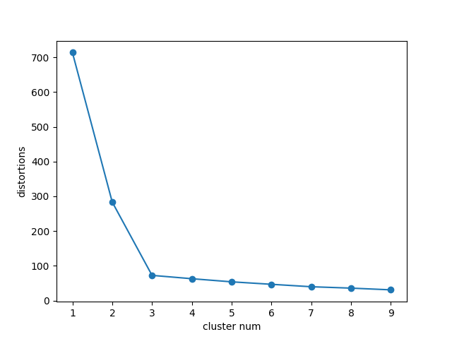

# elbow method

A functoin  to find good cluster number.

Repeat searching cluster and get inertia(measure of variation or "spread")

And clear a cluster num where "after the points, distortions decrease few".

It's best cluster number.

ref.

* http://www.talkstats.com/threads/clusters-and-inertia.14885/
* http://mathcenter.oxford.emory.edu/site/math117/standardDeviationAndMomentOfInertia/

3 is the number you want to in [main.py](./main.py)'s dataset.

