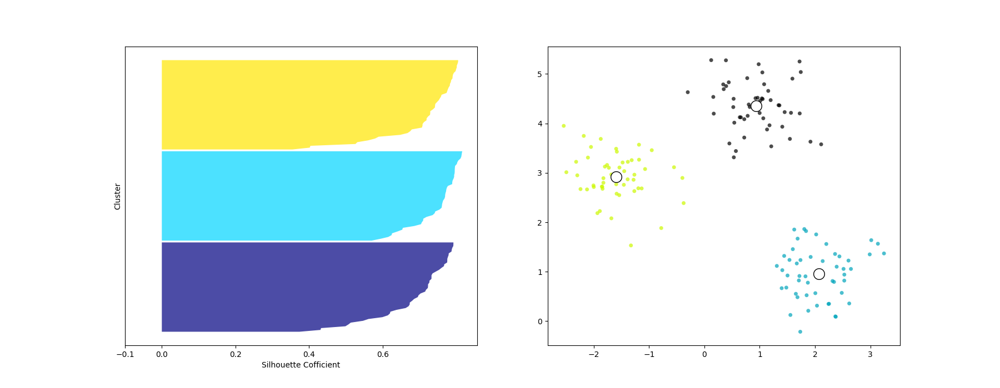
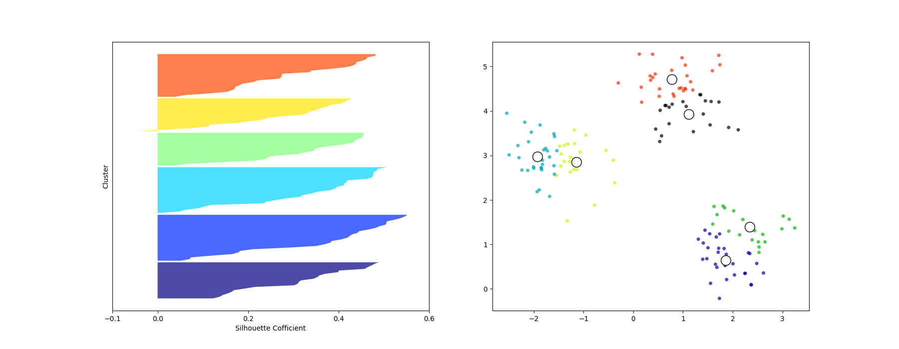

# silhouette analysis

In order to decide k of k-meaning, use silhouette analysis like [elobw method](../02_elbow_method/README.md).

When thickness of each silhouette is

* nearly same, it's better value for k
* differ, it's bad value for k

## nearly same - better value for k

Analysis found k = 3 is good, and visually, it's better value.

## differ - bad value for k

