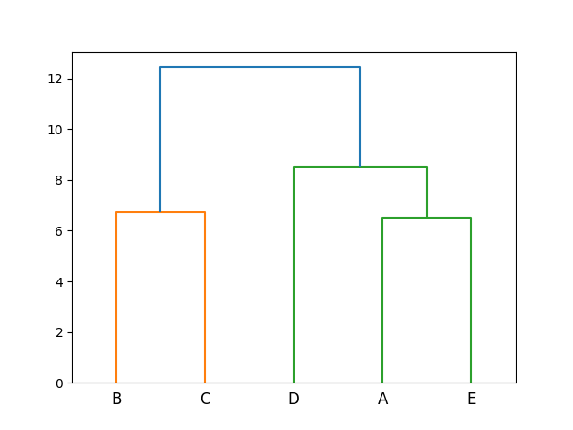

# distance and linkage

Unsupervised learning by getting distance and linkage.

## dendrogram

Figured out diagram after getting

* distance of 3d matrix's each vector
* complete linkage of the distance

When next to each other, the clusters are closed or "similar"

