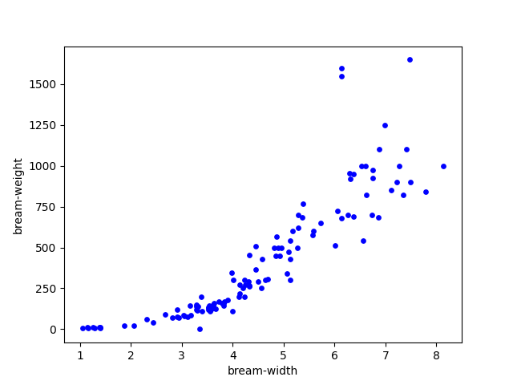
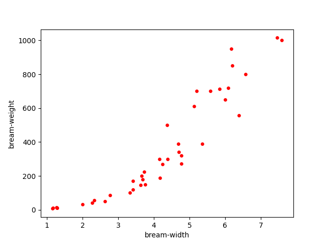

# Linear Regression

Bream's width-weight linear regression.

Data comes from [fish.csv](../data/fish.csv)

## train data



## test data



## measured data

```
learned coefficient: [[197.20708102]]
learned intercept: [-473.84487432]
training score: 0.82
test score: 0.77
```