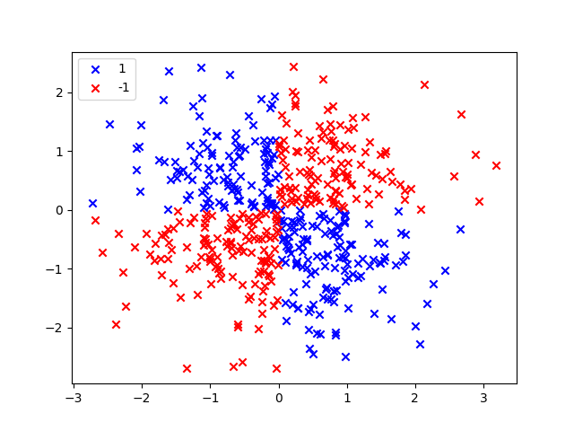
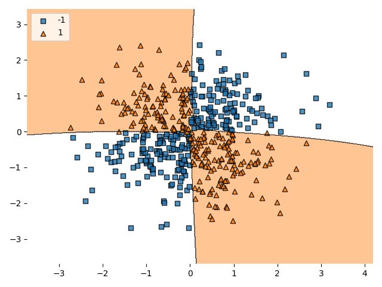

# non linear SVM

Kernerl is Radial Basis Function (RBF) kernel

## data preparation

* set 500x2 matrix as Xm_n. value is random
* convert Xm_n's value by the rule
  * 1 if value is over 0
  * -1 if value is equal or less than 0
* with value converted Xm_n, calculate xor by each row
  * `[X1 xor Y1, X2 xor Y2, ..., Xm xor Yn]`
  * #=> `[True, False, ..., True]`
* Change `True` or `False` as `1` or `-1`

## raw plot

## svm fit plot

