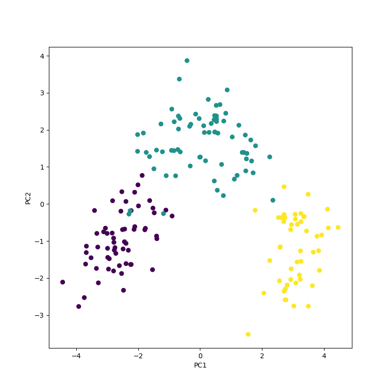

# Principal Component Analysis(PCA)

* (1) standardize data
* (2) create covariance-matrix from above data
* (3) get eigenvalue and eigenvecor from the matrix
* (4) by descending sort eigenvalue, rank engenvecor

When (2) to (4) is created by library, just prepare (1) by program.

## PCA data

